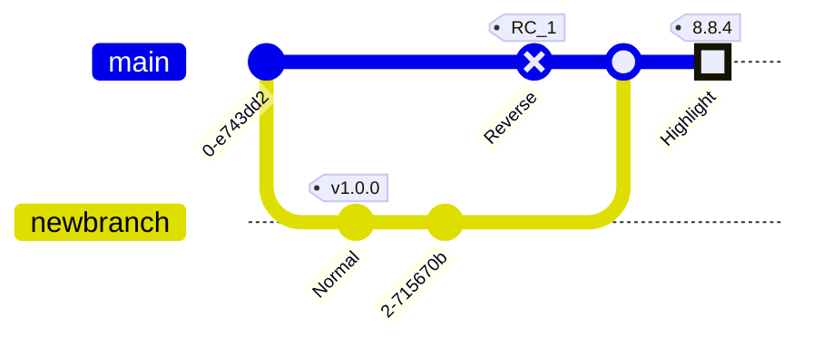

---
---

[](https://github.com/cben/sandbox)
[](https://gitlab.com/cben/sandbox)
[](https://bitbucket.org/cbensf/test-math)

sandbox
=======

Dummy project to test various aspects of github / gitlab / bitbucket and integrations with it (e.g. Netlify).

Testing [abuse of relative links to link to issues](http://stackoverflow.com/a/20829706/239657): [#1](/../../issues/1).

## markdown

On Github Pages, README processed by Jekyll into https://cben.github.io/sandbox/README.  
On GitLab Pages, README processed by Jekyll into https://cben.gitlab.io/sandbox/README.

- [ ] unchecked box

  Another paragraph  

- [x] checked box
  - [ ] sub-TODO
  - [x] sub-DONE

    Inner paragraph
    
  Outer paragraph
  
compare formatting to regular list:

- item
  - sub-TODO
  - sub-DONE

    Inner paragraph
    
  Outer paragraph

MathJax loaded in output via Jekyll template `_layouts/default.html`.

Delimiters [recognized by kramdown](http://kramdown.gettalong.org/syntax.html#math-blocks):

inline $$ \frac{kram}{down} \sum_0^\infty $$ text.

$$ \frac{kram}{down} \sum_0^\infty $$

The second is display math because it occurs alone in a block.

See also <katex.md> -> https://cben.github.io/sandbox/katex for using KaTeX instead of MathJax.

### Gitlab syntaxes

inline $`\frac{git}{lab} \sum_0^\infty`$ text.

```math
\frac{git}{lab} \sum_0^\infty
```

### Mermaid — mostly works in both GitHub & GitLab




### Single-dollar math?

- Is $\frac{tex}{math} \sum_0^\infty$ rendered?
- What about $10 to $20 prices?
- Adjacent text: non-$n^2$-secure ($n \log n$)?
- Whitespace inside: foo $ math $ bar?

### Linking to headers
#### Test explicit anchor {#test-anchor}

Does github support [explicit header anchors](https://talk.commonmark.org/t/anchors-in-markdown/247/28)?
[link to `#test-anchor`](#test-anchor) => No

Does GitHub [automatically generate ids for headers](https://talk.commonmark.org/t/feature-request-automatically-generated-ids-for-headers/115/80)?  Yes — [doc](https://help.github.com/articles/basic-writing-and-formatting-syntax/#section-links) 

- The links have no prefix: [link to `#linking-to-headers`](#linking-to-headers)
- However the actual anchor is prefixed `id="user-content-linking-to-headers"`!  [link to `#user-content-linking-to-headers`](#user-content-linking-to-headers)  
  Interesting, this prefixed link scrolls to a slightly different place than `#linking-to-headers`.  
  I'm not sure how the unprefixed `#linking-to-headers` link works at all, perhaps by JS parsing the URL?

### Links in SVG?
img tag: </img>
markdown image syntax: 
inline svg tag:
<svg width="62pt" height="44pt" viewBox="0.00 0.00 62.00 44.00">
 <g id="graph1" class="graph" transform="scale(1 1) rotate(0) translate(4 40)">
  <title>G</title>
  <polygon fill="white" stroke="white" points="-4,5 -4,-40 59,-40 59,5 -4,5"/>
  <!-- link -->
  <g id="node1" class="node"><title>link</title>
   <a xlink:href="http://google.com" xlink:title="link">
    <polygon fill="none" stroke="black" points="54,-36 2.4869e-14,-36 0,-1.77636e-14 54,-3.55271e-15 54,-36"/>
    <text text-anchor="middle" x="27" y="-14.9" font-family="Times Roman,serif" font-size="14.00">link</text>
   </a>
  </g>
 </g>
</svg>

See also https://github.com/cben/sandbox/issues/8 — SVG links don't work in issue comments either.

<div dir="rtl" markdown="1">

### Right-to-left עברית

נזכיר שעקומה מסדר שני היא בעלת מבנה כללי.
$$a_{1,1}x^2+2a_{1,2}xy+a_{2,2}y^2+a_1x+a_2y+a=0$$

**תרגיל**. צייר את העקום $$.4x^2+2\sqrt{3}xy+2y^2-6=0$$

**פתרון** כדי להבין את מבנה העקום נאפס את המקדם של המונום $$xy$$ באמצעות טרנספורמציה מתאימה בין מערכות קורדינאטות. לפי הנוסחא שפיתחנו בהרצאה,תמיד ניתן לסובב את מערכת הקורדינאטות ב $$\theta$$ מעלות נגד כיוון השעון ולקבל מערכת מתאימה $$O'$$ שבה העקום הוא בעל צורה קנונית. ...

</div>

<kbd>C-x</kbd> <kbd>M-c</kbd> <kbd>M-butterfly</kbd>

## Nested fenced blocks

`````markdown
Foo:
```ruby
block.parents.map {|b| b.language}
```
bar.
`````

---

 ## This is a `##` header(?) prefixed with a space, let's see if it counts as header?

## LaTeX sync playground

As of 2015–2016 my recommendadion for collaborative LaTeX editing is [Overleaf](https://overleaf.com) (former WriteLaTeX).
It has real-time collaborative editing but you can also [work offline using Git][1].

For co-authors that want to work offline / use their favorite editor, but that don't want to learn Git, Github is a good place because any github repo can transparently also be cloned over SVN!

But then what if you want to also edit offline?

- You can push/pull local clone to both overleaf and github.
  Tip: overleaf creates git commits when you save in overleaf UI, but also on demand when you `git fetch` / `git pull`.  So `git fetch` frequently to force more history :-)

- https://ShareLaTeX.com supports direct github sync.  (ShareLaTeX is mostly open source but this feature isn't.)  TODO: try it.

- I've enabled github sync for this repo on Authorea.
  **That's where all the .tex files come from** (and `layout.md` which is not really markdown but list of files).

[1]: https://www.overleaf.com/blog/195-new-collaborate-online-and-offline-with-overleaf-and-git-beta

P.S. shameless plug: if anybody is reading this and looking for collaborative *markdown* editing with math, try https://Mathdown.net.

----

- Testing push via svn with master configured "Protect this branch", "Include administrators".
